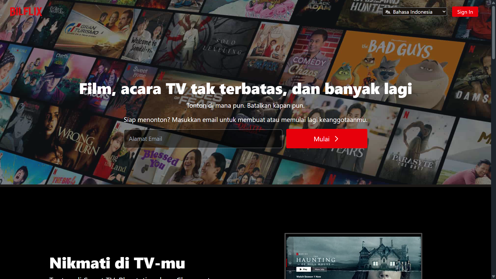
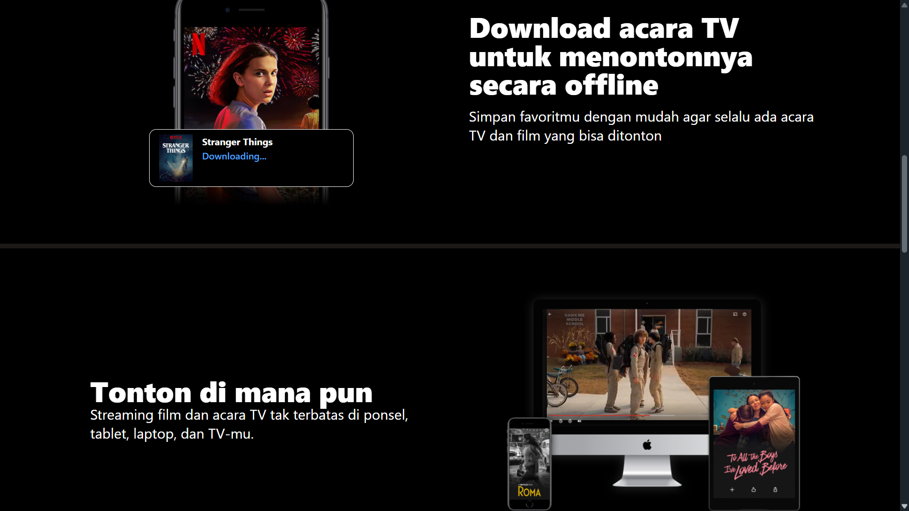
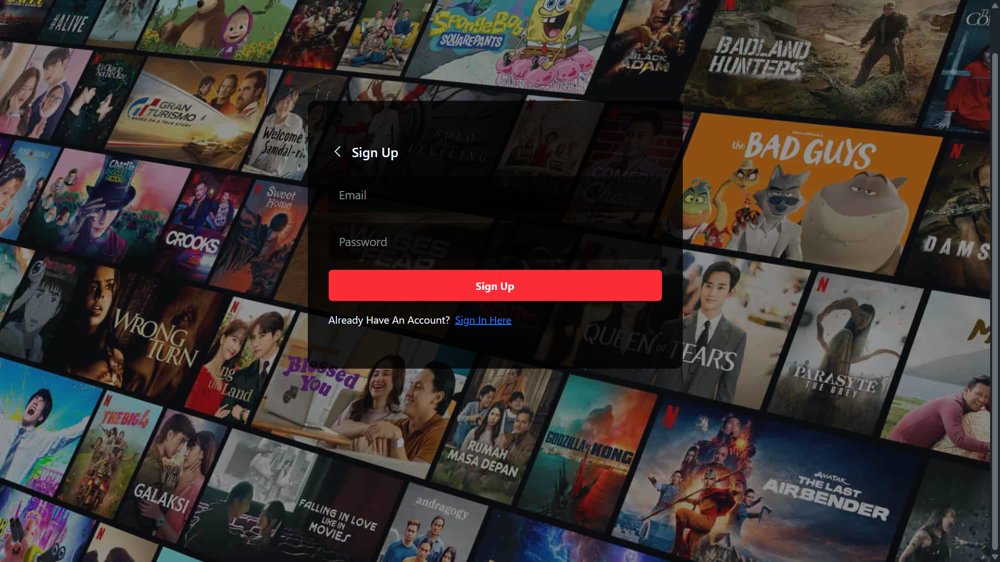
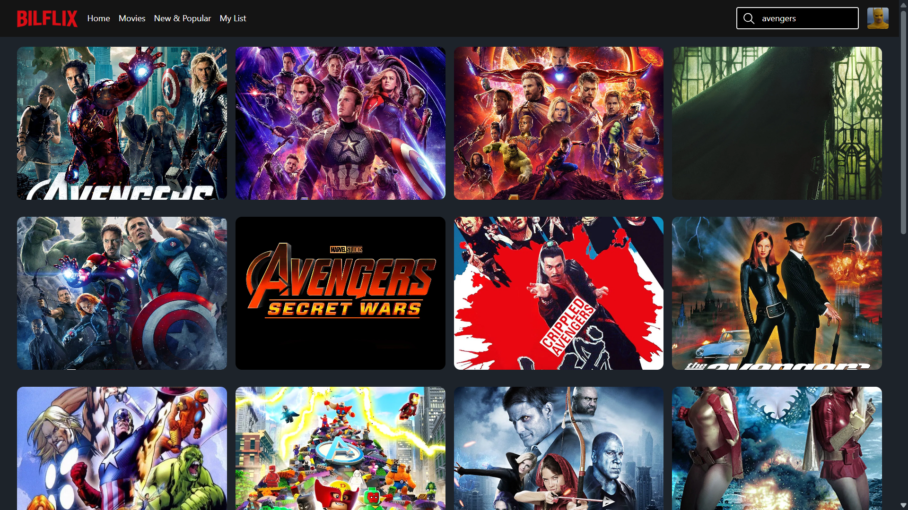
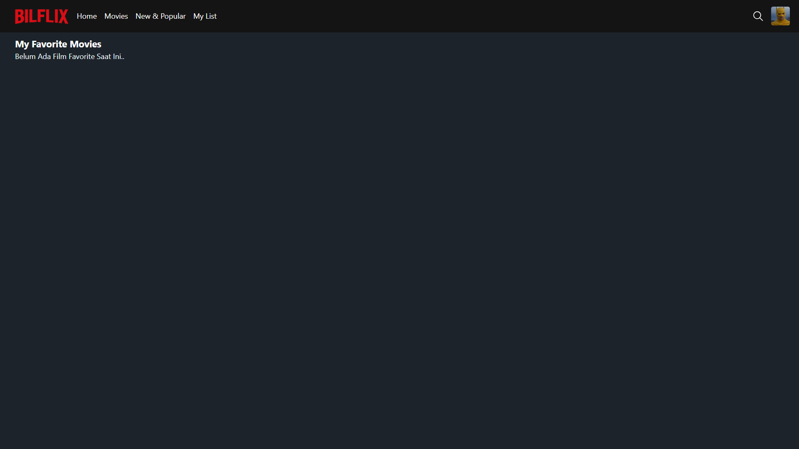
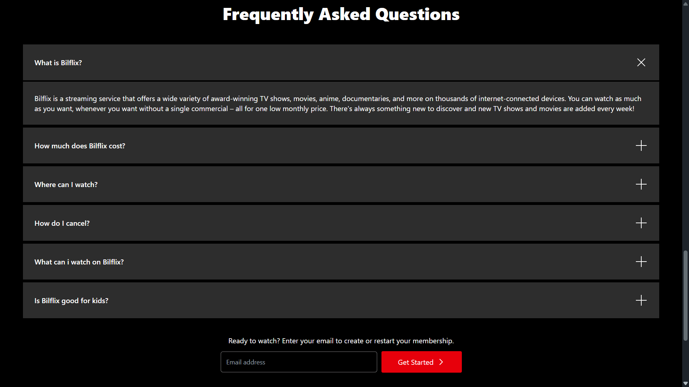
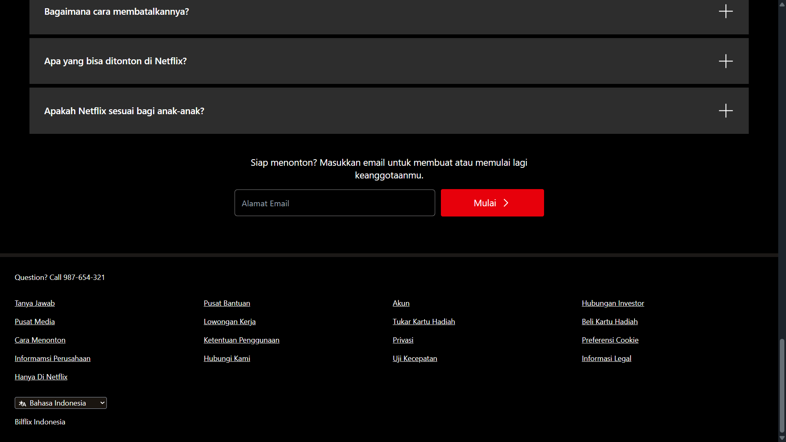

# 🎬 Bilflix Full-Stack Streaming App Demo (MERN)

> ⚠️ **Disclaimer:** Ini adalah proyek portofolio non-komersial, dibuat untuk belajar pengembangan full-stack (MERN Stack). Tidak berafiliasi dengan Netflix atau layanan streaming manapun.

A fully responsive, full-stack streaming app demo built with the MERN stack (MongoDB, Express, React, Node.js). This project integrates TMDB API for real-time movie data, Firebase for authentication, and custom JWT authorization for secure backend API calls.

> 🚧 Currently not deployed live — clone and run locally using the guide below. (Live demo link will be added here once redeployed.)
> 📖 API Documentation: (https://api-bilflix-sultan.vercel.app/docs/)

---

## ✨ Features

* **User Authentication:** Secure registration and login flow using Firebase Auth combined with custom JWT & Argon2 password hashing on the backend.
* **Browse & Search:** Fetch and display real-time movies and TV shows categorized by genres using the TMDB API.
* **My List (Favorites):** Authenticated users can add or remove movies to their personal favorite list, securely stored in MongoDB.
* **Responsive Design:** Fully optimized for desktop, tablet, and mobile viewing.
* **API Documentation:** Interactive API testing and documentation provided by Swagger UI (available when running locally).

---

## 📸 Screenshots

| Landing Page | Landing Page (2) |
|---|---|
|  |  |

| Sign In | Sign Up |
|---|---|
|  |  |

| Search | Favorites |
|---|---|
|  |  |

| FAQ | Footer |
|---|---|
|  |  |

---

## 🛠️ Tech Stack

**Frontend (`/REACTBILFLIX`)**
* React.js (Vite)
* Firebase (Authentication)
* Axios (Data Fetching)
* React Router DOM

**Backend (`/API-BILFLIX`)**
* Node.js & Express.js
* MongoDB & Mongoose
* JSON Web Token (JWT)
* Argon2 (Password Hashing)
* Swagger UI (API Docs)

**Deployment**
* Vercel (Frontend & Serverless Backend)

---

## 🚀 Getting Started (Run Locally)

This project uses a Monorepo structure. You need to run both the frontend and backend servers concurrently.

### 1. Clone the repository
```bash
git clone https://github.com/SultanNabil2002/mern-bilflix.git
cd mern-bilflix
```

### 2. Backend Setup
```bash
cd API-BILFLIX
npm install
```
Create a `.env` file in the `API-BILFLIX` folder and add the following variables:
```env
API_PORT=3002
MONGO_URL=your_mongodb_connection_string
JWT_SECRET=your_jwt_secret_key
```
Start the backend server:
```bash
npm run dev
```

### 3. Frontend Setup
Open a new terminal and navigate to the frontend folder:
```bash
cd REACTBILFLIX
npm install
```
Create a `.env` file in the `REACTBILFLIX` folder and add your TMDB and Firebase credentials:
```env
VITE_BASE_URL_TMDB=https://api.themoviedb.org/3/
VITE_BASE_URL_TMDB_IMAGE=https://image.tmdb.org/t/p/original
VITE_TOKEN_TMDB=your_tmdb_read_access_token

# Firebase
VITE_FIREBASE_API_KEY=your_firebase_api_key
VITE_FIREBASE_AUTH_DOMAIN=your_firebase_domain
VITE_FIREBASE_PROJECT_ID=your_firebase_project_id
VITE_FIREBASE_STORAGE_BUCKET=your_firebase_storage
VITE_FIREBASE_MESSAGING_SENDER_ID=your_sender_id
VITE_FIREBASE_APP_ID=your_app_id
VITE_FIREBASE_MEASUREMENT_ID=your_measurement_id

# Backend API URL
VITE_BASE_URL_EXPRESS=http://localhost:3002
```
Start the Vite development server:
```bash
npm run dev
```

---

## 👨‍💻 Author

**Sultan Nabil**
* [GitHub](https://github.com/SultanNabil2002)
